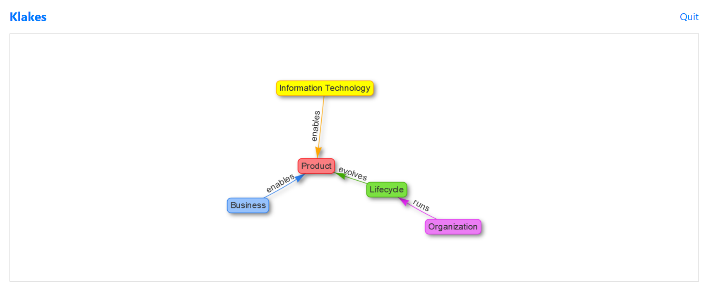
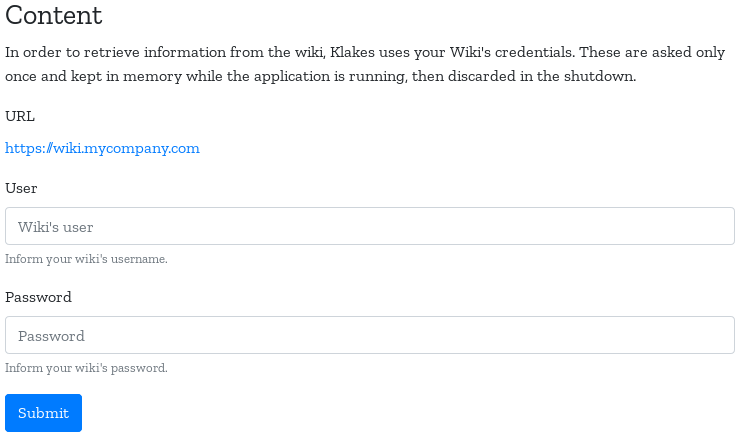

# Why Klakes?

Each individual has a mental model, a particular way of making sense of the world. Two people can observe the same event and describe it differently, because they have looked at different details and made different interpretations. This natural characteristic of human kind makes extremely hard for organizations to build a common understanding of what they do, build and sell among all employees.

Klakes stands for Knowledge Lakes and was designed to solve this problem. It targets organizations interested in mapping their knowledge in consistent "lakes" of information.

## Installation

### Requirements

Klakes is an application that runs on top of the Java Virtual Machine (JVM). This is the only requirement that needs to be fulfilled. Please, visit [Java.com][2], download the package for your operating system, and follow the installation instructions.

### Execution

To run Klakes, download the latest version of the file `klakes.jar` from the [release page][4]. Depending on your platform and how Java is installed and configured, you can double-click on the file `klakes.jar` to run it, otherwise open a terminal window and use the following command:

    $ java -jar klakes.jar

When the application is up and running, it opens a tab in your default web browser. As you can see, Klakes is a web application that doesn't require to be hosted on a server to deliver immediate value, but if the organization requires, it can be easily done because Klakes is a self contained application with all the dependencies included.

### Configuration

At first glance, Klakes looks boring because it is not ready to use yet. It is still necessary to load the knowledge model and to configure the access to the wiki. The following steps help you to achieve that:

1. **Load the Knowledge Model**: visit the Knowledge Model page using the top menu. Browse your desktop for the knowledge model file -- with the extension `.json` -- and load it into Klakes. When the load is complete a graph showing the relationships between the lakes appears. An [example of knowledge model][5] can be obtained from the project repository.

2. **Configure the connection to the Wiki**: when the application runs for the first time, it generates the file `config.edn` in the same folder where `klakes.jar` was executed. In that file, set the variable `:wiki-url` with the URL of Wiki:

    `{:wiki-url "https://wiki.mycompany.com"}`

You don't need to restart Klakes to have it working once the configuration is done. Now, you are all set.

## Usage

### Navigating on The Knowledge Lakes

To do.

### Tagging Content on the Wiki

To do.

### Retrieving Content from the Wiki

To retrieve information from the wiki while running in the desktop, Klakes uses your personal Wiki's credentials. These are asked only once and kept in memory while the application is running, then discarded in the shutdown. An authentication form appears when Klakes intends to access the Wiki's API but it doesn't have your credentials yet.

## Creating a Knowledge Model

During the [configuration](#configuration) of Klakes you loaded the knowledge model of your organization into the application. The `json` file contains data defined in [JSON][3] (JavaScript Object Notation) format, which is simple to write and read. The file is organized in 3 parts: a list of concepts, a list of predicates, and list of triples. These lists are alphabetically ordered and it is important to keep them that way when adding more elements.

### Concept

Add a new concept using the following structure:

    {
      "label": "business",
      "name": "Business",
      "definition": ""
    }

**label** is the identification of the concept in the wiki. Pages related to the concept are tagged with this label. **name** is used to show the concept on the user interface because sometimes the label is not human friendly. **definition** explains what is the concept, so users can properly apply them.

### Predicate

Add a new predicate using the following structure:

    {
      "verb": "bound",
      "name": "bounds",
      "influence": ""
    }

**verb** qualifies the influence a concept has over another. It can be active (i.e. build) or passive (i.e. is_built_by). **name** is used to show the verb on the user interface because sometimes the verb is not human friendly. **influence** is an explanation of the influence represented by the verb.

### Triple

To add a new triple, make sure you already have all the concepts and verb needed, so you can use the following structure:

    {
      "subject": "business",
      "predicate": "define",
      "object": "product"
    }

**subject** is a label representing an existing concept that is related to another concept through a predicate. **predicate** is the verb that qualifies the influence a concept has over another. **object** is a label representing another existing concept.

## References

- Ring Sessions: https://github.com/ring-clojure/ring

## License

Copyright © 2019 Hildeberto Mendonca

This program and the accompanying materials are made available under the terms of the Eclipse Public License 2.0 which is available at http://www.eclipse.org/legal/epl-2.0.

This Source Code may also be made available under the following Secondary Licenses when the conditions for such availability set forth in the Eclipse Public License, v. 2.0 are satisfied: GNU General Public License as published by the Free Software Foundation, either version 2 of the License, or (at your option) any later version, with the GNU Classpath Exception which is available at https://www.gnu.org/software/classpath/license.html.

[1]: http://localhost:3000/lakes
[2]: https://www.java.com/en/download/manual.jsp
[3]: https://json.org
[4]: https://github.com/htmfilho/klakes/releases
[5]: https://github.com/htmfilho/klakes/blob/master/knowledge-model.json.example