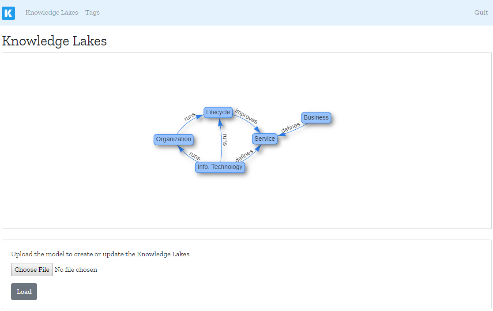

# Klakes

Klakes stands for Knowledge Lakes. It targets organizations interested in 
mapping their knowledge in consistent "lakes" of information.

## Installation

### Requirements

Klakes is an application that runs on top of the Java Virtual Machine (JVM).
This is the only requirement that needs to be fulfilled. Please, visit 
[Java.com][2], download the package for your operating system, and follow the 
installation instructions.

### Execution

To run Klakes, download the latest version of the file `klakes.jar` from the 
[release page](https://github.com/htmfilho/klakes/releases). Depending on your 
platform and how Java is installed and configured, you can double-click on the 
file `klakes.jar` to run it, otherwise open a terminal window and use the 
following command:

    $ java -jar klakes.jar

When the application is up and running, it opens a tab in your default web 
browser. As you can see, Klakes is a web application that doesn't require to be 
hosted on a server to deliver imediate value, but if the organization requires, 
it can be easily done because Klakes is a self contained application with all 
the dependencies included.

### Configuration

At first glance, Klakes looks boring because it is not ready to use yet. It is 
still necessary to load the knowledge model and to configure the access to the 
wiki. The following steps help you to achieve that:

1. **Load the Knowledge Model**: visit the Knowledge Model page using the top 
   menu. Browse your desktop for the knowledge model file -- with the extention 
   `.json` -- and load it into Klakes. When the load is complete a graph showing 
   the relationships between the lakes appears.

2. **Configure the connection to the Wiki**: when the application runs for the 
   first time, it generates the file `config.edn` in the same folder where 
   `klakes.jar` was executed. In that file, set the variable `:wiki-url` with 
   the URL of Wiki:
   
   `{:wiki-url "https://wiki.mycompany.com"}`

You don't need to restart Klakes to have it working once the configuration is 
done. Now, you are all set.

## Usage

### Navigating on The Knowledge Lakes

### Tagging Content on the Wiki

### Retrieving Content from the Wiki

## Creating a Knowledge Model

## License

Copyright © 2019 Hildeberto Mendonca

This program and the accompanying materials are made available under the
terms of the Eclipse Public License 2.0 which is available at
http://www.eclipse.org/legal/epl-2.0.

This Source Code may also be made available under the following Secondary
Licenses when the conditions for such availability set forth in the Eclipse
Public License, v. 2.0 are satisfied: GNU General Public License as published by
the Free Software Foundation, either version 2 of the License, or (at your
option) any later version, with the GNU Classpath Exception which is available
at https://www.gnu.org/software/classpath/license.html.

[1]: http://localhost:3000/lakes
[2]: https://www.java.com/en/download/manual.jsp